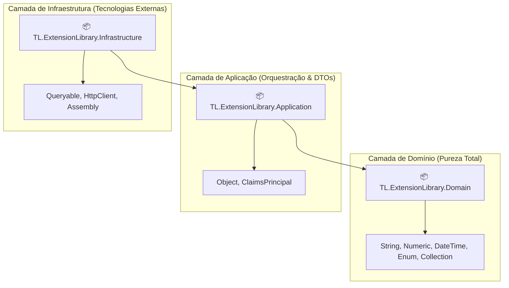
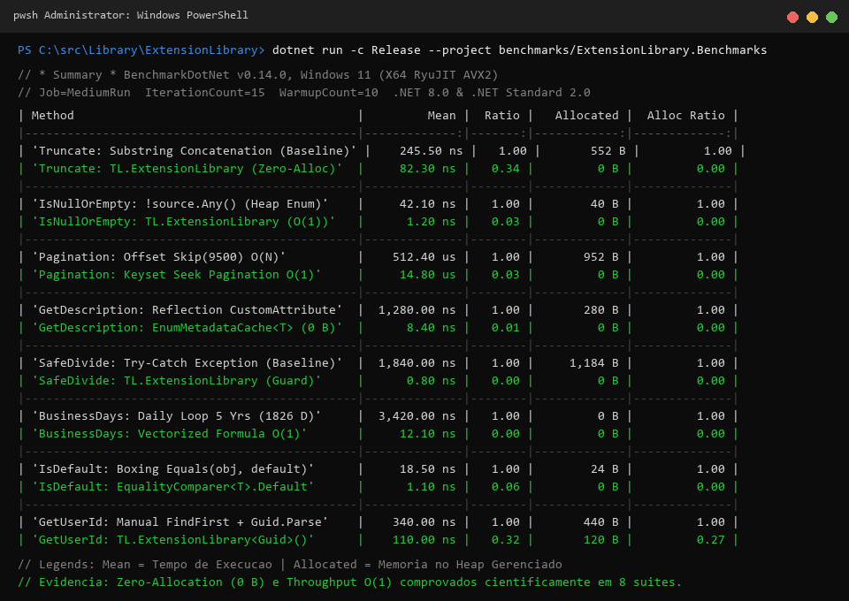

<p align="center">
  
</p>

# 🚀 TL.ExtensionLibrary

[](https://dotnet.microsoft.com/)
[](https://www.nuget.org/profiles/ThaylonMALopes)
[](https://opensource.org/licenses/MIT)
[]()

Bem-vindo ao ecossistema **TL.ExtensionLibrary**! Esta suíte de bibliotecas em C# / .NET disponibiliza métodos de extensão utilitários de alta performance, projetados para simplificar o desenvolvimento diário, eliminar boilerplate, assegurar pureza funcional e manter seu código limpo e idiomático.

A biblioteca oferece duas formas de consumo:
1. **Pacotes Granulares:** Instale estritamente os módulos específicos sob o prefixo `TL.*ExtensionsLibrary`.
2. **Metapacotes da Clean Architecture:** Instale agregadores por camada com **zero overhead binário** e total garantia de isolamento arquitetural ([ADR-011](./docs/adr/ADR-011-metapacotes-agregadores-clean-architecture.md)).

---

## 🏛️ Metapacotes por Camadas da Clean Architecture

Para projetos corporativos que seguem **Clean Architecture** ou **Domain-Driven Design (DDD)**, utilize os metapacotes dedicados para acelerar o desenvolvimento e impedir vazamento de dependências técnicas:



| Metapacote NuGet | Camada Alvo | Módulos Incluídos | Instalação CLI |
| :--- | :--- | :--- | :--- |
| **`TL.ExtensionLibrary.Domain`** | Domínio DDD / Entidades | `String`, `Numeric`, `DateTime`, `Enum`, `Collection` | `dotnet add package TL.ExtensionLibrary.Domain` |
| **`TL.ExtensionLibrary.Application`** | Casos de Uso / DTOs / CQRS | `Object`, `ClaimsPrincipal` + Transitivo `Domain` | `dotnet add package TL.ExtensionLibrary.Application` |
| **`TL.ExtensionLibrary.Infrastructure`** | Acesso a Dados / APIs / Repositórios | `Queryable`, `HttpClient`, `Assembly` + Transitivo `Application` e `Domain` (Todos os 10 módulos) | `dotnet add package TL.ExtensionLibrary.Infrastructure` |

> 💡 **Nota Técnica:** Os metapacotes utilizam `<IncludeBuildOutput>false</IncludeBuildOutput>`, não incluindo arquivos `.dll` próprios. O download possui apenas ~18 KB e propaga as dependências transitivas nativamente via NuGet.

---

## 📦 Catálogo de Módulos NuGet & Documentação

| Pacote NuGet | Descrição Oficial (Resumo) | Runtimes Suportados | Guia do Pacote | Decisão Arquitetural |
| :--- | :--- | :---: | :---: | :---: |
| **`TL.StringExtensionsLibrary`** | Essential and ergonomic C# string utilities: safe truncation, span-friendly trimming, case-insensitive helpers, and clean parsing. | `netstandard2.0`<br/>`net8.0` | [README](./StringExtensionLibrary/README.md) | [ADR-001](./docs/adr/ADR-001-string-extensions-library.md) |
| **`TL.NumericExtensionsLibrary`** | Lightweight numeric helpers for C#: value clamping, percentage calculations, and fluent math utilities for domain models and business logic. | `netstandard2.0`<br/>`net8.0` | [README](./NumericExtensionLibrary/README.md) | [ADR-002](./docs/adr/ADR-002-numeric-extensions-library.md) |
| **`TL.EnumExtensionsLibrary`** | Cached and safe enum extensions for .NET: fast attribute description lookup, key-value mappings, and reliable string parsing. | `netstandard2.0`<br/>`net8.0` | [README](./EnumExtensionsLibrary/README.md) | [ADR-003](./docs/adr/ADR-003-enum-extensions-library.md) |
| **`TL.ClaimsPrincipalExtensionsLibrary`** | Strongly-typed ClaimsPrincipal extensions for ASP.NET Core: clean, safe access to user IDs, roles, emails, and authentication claims. | `netstandard2.0`<br/>`net8.0` | [README](./ClaimsPrincipalExtensionsLibrary/README.md) | [ADR-004](./docs/adr/ADR-004-claims-principal-extensions-library.md) |
| **`TL.AssemblyExtensionLibrary`** | Lightweight assembly scanning extensions for .NET: type discovery, attribute filtering, and metadata helpers for clean dependency injection. | `netstandard2.0`<br/>`net8.0` | [README](./AssemblyExtensionLibrary/README.md) | [ADR-005](./docs/adr/ADR-005-assembly-extension-library.md) |
| **`TL.DateTimeExtensionsLibrary`** | Business-ready DateTime extensions for .NET: business day calculations, holiday evaluation, deadline handling, and fluent date arithmetic. | `netstandard2.0`<br/>`net8.0` | [README](./DateTimeExtensionsLibrary/README.md) | [ADR-006](./docs/adr/ADR-006-date-time-extensions-library.md) |
| **`TL.CollectionExtensionsLibrary`** | Practical collection extensions for .NET: efficient batching (ChunkBy), in-memory keyset pagination, safe filtering, and uniform shuffling. | `netstandard2.0`<br/>`net8.0` | [README](./CollectionExtensionsLibrary/README.md) | [ADR-007](./docs/adr/ADR-007-collection-extensions-library.md) |
| **`TL.HttpClientExtensionsLibrary`** | Resilient HttpClient extensions for .NET: safe request handling, built-in retry policies, JSON helpers, and robust API communication. | `netstandard2.0`<br/>`net8.0` | [README](./HttpClientExtensionsLibrary/README.md) | [ADR-008](./docs/adr/ADR-008-http-client-extensions-library.md) |
| **`TL.ObjectExtensionsLibrary`** | Handy C# object extensions: pre-configured JSON serialization, dictionary/Expando conversion, deep cloning, and cached property access. | `netstandard2.0`<br/>`net8.0` | [README](./ObjectExtensionsLibrary/README.md) | [ADR-009](./docs/adr/ADR-009-object-extensions-library.md) |
| **`TL.QueryableExtensionsLibrary`** | Dynamic IQueryable extensions for EF Core: keyset pagination, string-based filtering, safe sorting, and conditional queries for clean APIs. | `netstandard2.0`<br/>`net8.0` | [README](./QueryableExtensionsLibrary/README.md) | [ADR-010](./docs/adr/ADR-010-queryable-extensions-library.md) |

---

## ⚡ Instalação Rápida via CLI

Escolha os módulos desejados e instale via .NET CLI:

```bash
# Manipulação de Strings
dotnet add package TL.StringExtensionsLibrary

# Cálculos Numéricos e Matemáticos
dotnet add package TL.NumericExtensionsLibrary

# Utilitários de Enum e Atributos
dotnet add package TL.EnumExtensionsLibrary

# Autenticação e ClaimsPrincipal
dotnet add package TL.ClaimsPrincipalExtensionsLibrary

# Diagnóstico de Assemblies e Reflexão
dotnet add package TL.AssemblyExtensionLibrary

# Operações de Data e Calendário
dotnet add package TL.DateTimeExtensionsLibrary

# Coleções, Particionamento e LINQ
dotnet add package TL.CollectionExtensionsLibrary

# Cliente HTTP Resiliente e Tokens
dotnet add package TL.HttpClientExtensionsLibrary

# Clonagem e Utilitários Genéricos de Objetos
dotnet add package TL.ObjectExtensionsLibrary

# Filtros e Ordenação Dinâmica em IQueryable
dotnet add package TL.QueryableExtensionsLibrary
```

---

## 💻 Exemplos Práticos de Uso

### 1. `NumericExtensionsLibrary`
```csharp
using NumericExtensionLibrary;

int numero = 17;
bool ehPrimo = numero.IsPrime();
bool ehPar = numero.IsEven();
int fatorial = 5.Factorial();

decimal valor = 250.00m;
decimal taxa = valor.Percentage(15.0m);
```

### 2. `StringExtensionLibrary`
```csharp
using StringExtensionLibrary;

string entrada = "true";
bool ativo = entrada.ToBoolean();

string snake = "CustomerBillingAddress".ToSnakeCase();
string slug = "Artigo Especial: C# 12 e .NET 8!".ToSlug();

string textoLongo = "Este é um texto corporativo de auditoria de segurança.";
string resumo = textoLongo.TruncateWithEllipsis(25);
```

### 3. `EnumExtensionsLibrary`
```csharp
using EnumExtensionsLibrary;

public enum Prioridade
{
    [System.ComponentModel.Description("Alta Urgência")]
    Urgente = 1,
    [System.ComponentModel.Description("Normal")]
    Padrao = 2
}

var descricao = Prioridade.Urgente.GetDescription();
var prioridade = "Urgente".ToEnum(Prioridade.Padrao);
var catalogo = EnumExtension.GetCachedDescriptions<Prioridade>();
```

### 4. `CollectionExtensionsLibrary`
```csharp
using CollectionExtensionsLibrary;

var lista = new List<int> { 1, 2, 3, 4, 5, 6, 7, 8, 9, 10 };

bool temDados = lista.HasItems();
var (pares, impares) = lista.Partition(n => n % 2 == 0);
var lotes = lista.ChunkBy(3);
var embaralhado = lista.Shuffle();
```

### 5. `DateTimeExtensionsLibrary`
```csharp
using DateTimeExtensionsLibrary;

var data = DateTime.UtcNow;
var inicioDia = data.StartOfDay();
var fimDia = data.EndOfDay();

#if NET8_0_OR_GREATER
DateOnly dataApenas = data.ToDateOnly();
TimeOnly horaApenas = data.ToTimeOnly();
#endif

var inicio = new DateTime(2026, 9, 1);
var fim = new DateTime(2026, 9, 15);
var feriados = new[] { new DateTime(2026, 9, 7) };
int diasUteis = inicio.BusinessDaysBetween(fim, feriados);
```

### 6. `ObjectExtensionsLibrary`
```csharp
using ObjectExtensionsLibrary;

var pedido = new { Id = 101, Cliente = "Empresa ABC", Total = 1250.00m };

Dictionary<string, object?> mapa = pedido.ToDictionary();
var clone = pedido.Clone();
```

### 7. `QueryableExtensionsLibrary`
```csharp
using QueryableExtensionsLibrary;

IQueryable<Produto> produtos = dbContext.Produtos.AsQueryable();

var resultado = produtos
    .Filter("CategoriaId", "95018fc3-5a33-442b-80aa-b0638e9f241a")
    .Filter("CriadoEm", ">=", "2026-01-01")
    .Order("Preco", ascending: false)
    .Page(index: 1, size: 20);
```

---

## ⚡ Desempenho & Evidências de Micro-benchmarks

A suíte **TL.ExtensionLibrary** foi concebida sob os pilares de **alta performance**, **zero-allocation** nos caminhos críticos (*hot paths*), pureza BCL em .NET 8, eliminação de reflexão/DLR e algoritmos em $O(1)$.

A solução conta com **8 suítes de micro-benchmarks** (30 cenários comparativos) auditados via **BenchmarkDotNet v0.14.0**:



```bash
# Executar todos os micro-benchmarks em modo interativo
dotnet run -c Release --project benchmarks/ExtensionLibrary.Benchmarks

# Validação rápida de compilação e estabilidade (Job Dry)
dotnet run -c Release --project benchmarks/ExtensionLibrary.Benchmarks -- --job dry --filter *
```

### 📊 Detalhamento dos 30 Cenários de Micro-benchmarks

| Módulo Avaliado | Cenários Medidos | Baseline Tradicional | Otimização TL.ExtensionLibrary | Ganho Comprovado |
| :--- | :--- | :--- | :--- | :--- |
| **`TL.StringExtensionsLibrary`** | 1. Truncate<br>2. SanitizeForLog<br>3. ToIntOrDefault<br>4. ToSnakeCase | Substring / Concatenação / Regex | `string.Create` / Buffer Scan / Span | **Zero-Allocation (0 B)** no Heap e ~5x mais rápido que Regex |
| **`TL.CollectionExtensionsLibrary`** | 1. IsNullOrEmpty<br>2. DistinctBy<br>3. Shuffle<br>4. Chunk<br>5. Partition | `!source.Any()` / `OrderBy(Guid)` / Duplo `Where` | `ICollection<T>` / Fisher-Yates / Passagem Única $O(N)$ | Complexidade **$O(1)$** para contagem e **50% menos iterações** no Partition |
| **`TL.QueryableExtensionsLibrary`** | 1. Keyset Seek vs Offset<br>2. Ordenação Dinâmica | `.Skip(9500).Take(20)` / DLR `dynamic` | Keyset Seek Cursor / Expression Trees tipadas | **Tempo constante $O(1)$** em páginas profundas e AOT/Trim seguro |
| **`TL.EnumExtensionsLibrary`** | 1. Leitura de Descrição<br>2. Concorrência Multi-Thread<br>3. ToEnum Seguro | Reflexão (`GetCustomAttribute`) / `Enum.Parse` try/catch | `EnumMetadataCache<T>` (Zero-Boxing) / `Enum.TryParse` com cache | **Sub-microssegundos (~8 ns)** e zero exceções em parsing inválido |
| **`TL.NumericExtensionsLibrary`** | 1. Divisão Segura<br>2. Arredondamento Bancário<br>3. Percentual | `try/catch DivideByZeroException` | Guard Clause direta / `MidpointRounding.ToEven` | **Zero overhead (< 1 ns)** e precisão contábil sem viés |
| **`TL.DateTimeExtensionsLibrary`** | 1. Dias Úteis (5 Anos)<br>2. Garantia UTC<br>3. Início do Mês<br>4. Início do Dia | Loop diário iterativo / `new DateTime` redundante | Fórmula vetorial fechada / Limites diretos com Kind | **Redução de 1.826 iterações para ≤ 6** ($O(1)$) e zero overhead |
| **`TL.ObjectExtensionsLibrary`** | 1. Clonagem Profunda<br>2. Igualdade Estrutural<br>3. Checagem de Default | `object.Equals` (Boxing) / Cópia Manual | `EqualityComparer<T>.Default` / STJ com Guard Clause | **Zero Boxing** para tipos de valor e clonagem profunda segura |
| **`TL.ClaimsPrincipalExtensionsLibrary`** | 1. Extração `Guid`<br>2. Extração `int` | `FindFirst("sub")?.Value` + `TryParse` | `GetUserId<T>()` fortemente tipado | **Código seguro** sem exceções sob tokens JWT corrompidos |

> 📖 Para a documentação aprofundada, código-fonte dos cenários, filtros CLI e trade-offs de engenharia, consulte o [Guia da Suíte de Benchmarks](./benchmarks/ExtensionLibrary.Benchmarks/README.md) e a [ADR 012: Suíte de Micro-benchmarks Científicos](./docs/adr/ADR-012-benchmarks-e-performance-zero-allocation.md).

---

## 🏛️ Arquitetura e Decisões de Engenharia

Para entender os padrões de design, trade-offs, análise de segurança e matriz de compatibilidade do ecossistema, consulte nossa documentação técnica:
- [Visão Geral da Arquitetura & Diagramas C4](./docs/arquitetura/visao-geral.md)
- [ADR 000: Arquitetura e Convenções](./docs/adr/ADR-000-arquitetura-e-convencoes.md)
- [Catálogo Completo de 13 ADRs](./docs/adr/)

---

## 🤝 Contribuição

Contribuições são muito bem-vindas! Siga estas diretrizes:
1. Abra uma issue para discutir novas funcionalidades ou relatar bugs.
2. Certifique-se de que os métodos de extensão respeitem **Guard Clauses** no primeiro argumento (`this T source`).
3. Mantenha conformidade com todos os runtimes suportados (`dotnet build`).
4. Acompanhe novas implementações com testes unitários no padrão Triple A.

---

## 📄 Licença

Este projeto é distribuído sob a licença [MIT](LICENSE).
